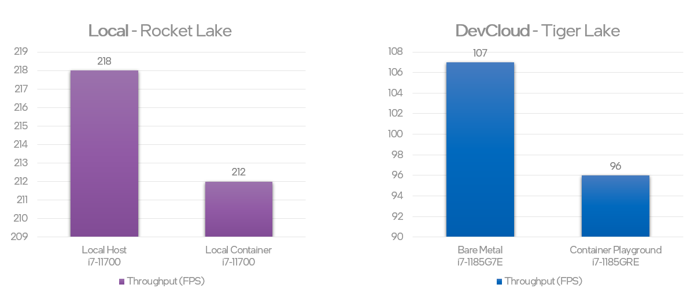

# Benchmarking AI Workloads on Edge
Repo to perform evaluation of AI inference workload consistantly across environments.

1. **Local:** Host vs Containerized
2. **DevCloud:** Bare-Metal vs Container Playground

## Results
https://ark.intel.com/content/www/us/en/ark/compare.html?productIds=212279,208082,208076


| Environment | Code Name | Platform | RAM | #1 FPS | #2 FPS | #3 FPS | Median FPS
| :---- | :---: | :---: | :---: | :---: | :---: | :---: | :---: |
| Local Host | RocketLake, Q1-21' | 11th Gen Intel(R) Core(TM) i7-11700 @ 2.50GHz | 16GB | 216.86 | 218.61 | 222.28 | 218 |
| Local Container | RocketLake, Q1-21' | 11th Gen Intel(R) Core(TM) i7-11700 @ 2.50GHz | 16GB | 214.26 | 210.82 | 212.31 | 212 |
| DevCloud Bare-Metal | TigerLake, Q3-20' | 11th Gen Intel(R) Core(TM) i7-1185G7E @ 2.80GHz | 16GB | 107.01 | 104.83 | 109.20 | 107 |
| DevCloud Container Playground | TigerLake, Q3-20' | 11th Gen Intel(R) Core(TM) i7-1185GRE @ 2.80GHz | 16GB | 94.39 | 96.32 | 98.20 | 96 |

### Host vs Container Comparison

<p align="center">
  
</p>

### Variance on multiple runs

<p align="center">
  
</p>

## Evaluation Steps

### Local install & activate
```
python3 -m pip install --user virtualenv 
python3 -m venv openvino_env
source openvino_env/bin/activate
python -m pip install --upgrade pip
```

### Install ov local
```
pip install openvino-dev[caffe]
```

### Download & convert model
```
omz_downloader --name mobilenet-ssd
omz_converter --name mobilenet-ssd --precisions FP16

//if errors in converting use below in venv
pip install --upgrade protobuf==3.20.0
```

### Download test images
```
mkdir test_images && \
curl -o test_images/dog.jpg https://storage.openvinotoolkit.org/data/test_data/images/dog.jpg && \
curl -o test_images/person_detection.png https://storage.openvinotoolkit.org/data/test_data/images/person_detection.png && \
curl -o test_images/cat.jpg https://storage.openvinotoolkit.org/data/test_data/images/cat.jpg && \
curl -o test_images/car1.png https://storage.openvinotoolkit.org/data/test_data/images/car.png && \
curl -o test_images/car2.bmp https://storage.openvinotoolkit.org/data/test_data/images/car_1.bmp
```

### Run profiling with default python app
```
benchmark_app -m public/mobilenet-ssd/FP16/mobilenet-ssd.xml -i test_images -t 20 -d CPU -stream_output -hint throughput
```

### Docker commands
```
docker build -t profiling:latest .
docker run --rm profiling:latest
```

### DevCloud job
```
qsub -l nodes=1:idc045 job.sh
```

## Todos
- [x] Identify initial common: container - dockerfile, host - tool, input, model, etc.
- [ ] Tweak benchmark_app args for final evaluation
- [x] Generate functional port for DevCloud with minimal changes
- [x] Ensure identical containerized version with minimal changes
- [x] Run on DevCloud Bare-Metal (same hw)
- [x] Run on DevCloud Container Playground (same hw)
- [x] Run on Local host
- [x] Run on local machine container
- [x] (stretch): Python vs CPP for comparison with published benchmark results